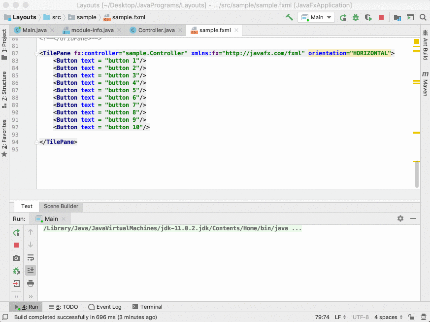

## Entry 4: Time to Move On From the Basics! :running:
---

### Journey Continues!!! 

Last week, I scratch the surface of the Java class and found many shared-characteristics with Ruby class. As I continue to explore the Java class, I found that Java is a lot more confusing than Ruby in term of syntax.  

---

### Constructor

A constructor is a method that is used to initialized a new object. Let's take a lot of the example below:

```java
public BankAccount(String accountNumber,int balance) { // this a constructor within a BankAccount class
    this.accountNumber = accountNumber; // everytime a new BankAccount is created, it will be initialize with an accountNumber
    this.balance = balance; // and a balance
}
```

#### Empty Constructor

An empty constructor is when there is no field assigned, in other words, it's a constructor without a parameter. For instance, the code below is an empty constructor: 

```java
public BankAccount() { // there is no parameter for this constructor
}
```

However, an empty constructor has no usage at all. Therefore, we want to call another constructor inside the empty constructor. This will force the program to create a new class with a default value. Let's take a look:


``` java
public BankAccount(String accountNumber,int balance) {
    this.accountNumber = accountNumber; 
    this.balance = balance; 
}

public BankAccount() { // this is an empty constructor
        this("4400123456789876", 10000 ); // this is calling the constructor on the top and assign a default account and balance
    } // "4400123456789876" is the account, 10000 is the balance
```

It's really useful to call a constructor from a different constructor because it will ensure that your object has all the required piece of information (parameter) so the program will not return an error

---
### Inheritances 

Inheritance is when a class inherit or adapt property from another class, there are several benefits of using inheritances.
+ It eliminates the unnecessary repetition of the code
+ It can be used multiple times to adapt to different classes
+ You can always override the code from the original class

In Java, we use `extend` keyword for the inheritances class


``` java

public class Animal { // this is an animal class

    private String name; // every animal has a name
    private int body; // and a body

    public Animal(String name, int brain) {
        this.name = name;
        this.brain = brain;
    }
}
  

public class Dog extends Animal { // this is a dog class that inherited property from animal class

    private int tails; // this class also have its special properties
    private int teeth; // tails and teeth

    public Dog(String name, int body, int tail, int teeth) {
        super(name, 1); // we use keyword super to call the constructor from animal class and give it default of 1 body
        this.tails = tails;
        this.teeth = teeth;
    }
```

### Overriding Method

What if we do not want to use the method in the `super` (original) class is not specific for the current class? This is when we want to use overriding methods


```java
public void eat() { // this is a method in animal class
        System.out.println("Animal is eating");
}

@Override // we use @Override to indicate the overriding method
public void eat() { // this is a overriding method in dog class
  System.out.println("Dog is eating"); // instead of saying animal is eating, we print out dog is eating
}
```

---


### Enough of Class, Let's Do Something Else! :satisfied:

Since I'm following the online curriculum, it's impossible to learn every Java syntax within these 9 weeks. There is so many more lesson after class, such as composition, encapsulation, and polymorphism, but I decided to skip ahead and come back in the future. It's a tough decision for me to make because I want to know every detail of Java. However, my goal is to create something at the end of the nine-week instead of mastering every single piece of Java syntax, and as a result, I finally start the lesson on JavaFX.


## What is JavaFX?

According to Oracle, JavaFX is JavaFX is "a set of graphics and media packages that enables developers to design, create, test, debug, and deploy rich client applications that operate consistently across diverse platforms". In short, it allows the programmer to create something that is interactive with the user instead of just coding at the backend.

###### _[And See more here :see_no_evil:](https://docs.oracle.com/javafx/2/overview/jfxpub-overview.htm)_


--- 

### JavaFX Layouts

---

#### GridPane
In gridpane, you can assign the position of its child elements using column and row system. 
+ The default value for column and row will Be 0.
+ Each column's width will be the width of the largest element
+ Each row's height will be the height of the largest element

```java
<GridPane fx:controller="sample.Controller" xmlns:fx="http://javafx.com/fxml" alignment="top_center" hgap="10" vgap="10" gridLinesVisible="true">
    <padding> // set up a top padding of 10
        <Insets top = "10"/>
    </padding>
        <columnConstraints> // force each column to take up maximum 50% of the  window
            <ColumnConstraints percentWidth="50.0" />
            <ColumnConstraints percentWidth="50.0" />
        </columnConstraints>
    <Button text = "Button one" GridPane.rowIndex="0" GridPane.columnIndex="0" GridPane.halignment = "RIGHT"/> // horizontally align to the right
    <Button text = "Button two" GridPane.rowIndex="0" GridPane.columnIndex="1"/>
    <Button text = "Button three" GridPane.rowIndex="1" GridPane.columnIndex="0"/>
    <Button text = "Long button four" GridPane.rowIndex="3" GridPane.columnIndex="0"
            GridPane.columnSpan="2"/>
    <Button text = "Button five" GridPane.rowIndex="2" GridPane.columnIndex="0"/>
</GridPane>
```


--- 

#### VBox & HBox
In VBox & Hbox, everything align vertically (VBox) or horizontally (HBox)
+ Often use for dialogue 

```java
<VBox fx:controller="sample.Controller"
         xmlns:fx="http://javafx.com/fxml" alignment="bottom_right"
         style="-fx-border-color:red; -fx-border-width: 3; -fx-border-style: dashed"
         spacing="10">
    <padding>
        <Insets bottom="10" right="10" />
    </padding>
    <Button text = "Okay" prefWidth="90"/>
    <Button text = "Cancel" prefWidth="90"/>
    <Button text = "Help" prefWidth="90" />

</VBox>
```


```java
<HBox fx:controller="sample.Controller"
         xmlns:fx="http://javafx.com/fxml" alignment="bottom_right"
         style="-fx-border-color:red; -fx-border-width: 3; -fx-border-style: dashed"
         spacing="10">
    <padding>
        <Insets bottom="10" right="10" />
    </padding>
    <Button text = "Okay" prefWidth="90"/>
    <Button text = "Cancel" prefWidth="90"/>
    <Button text = "Help" prefWidth="90" />

</HBox>
```


---

#### BorderPane
In borderline, it separates into five sections
+ All top, bottom, left, and left are fixed
+ center will have the leftover space

```java
<BorderPane fx:controller="sample.Controller" xmlns:fx="http://javafx.com/fxml">
    <top> // top section
        <Label text = "top  position" alignment="center" BorderPane.alignment="center" style="-fx-border-color: blue; "/>
    </top>

    <center>
        <Label text ="centercentercentercentercentercentercentercentercentercentercenter"/>
    </center>

    <left>
        <Label text = "left position" alignment="center"/>
    </left>

    <right>
        <Label text = "right position" alignment="center"/>
    </right>

    <bottom>
        <HBox spacing="10" alignment="top_right">
            <padding>
                <Insets bottom="10" right="10" />
            </padding>
            <Button text = "Okay" prefWidth="90"/>
            <Button text = "Cancel" prefWidth="90"/>
            <Button text = "Help" prefWidth="90" />
        </HBox>
    </bottom>
</BorderPane>
```


--- 

#### Flowpane & Tilepane
In both flowpane and titlepane, the object will flow into the next column/row if there is no space available
+ Both have the same syntax
+ Object won’t cut off as VBox and HBox
+ Use when you don’t know many child elements are there
+ Titlepane's width and height are determined by the largest object while flowpane isn't

```java
<TilePane fx:controller="sample.Controller" xmlns:fx="http://javafx.com/fxml" orientation="HORIZONTAL">
    <Button text = "button 1"/>
    <Button text = "button 2"/>
    <Button text = "button 3"/>
    <Button text = "button 4"/>
    <Button text = "button 5"/>
    <Button text = "button 6"/>
    <Button text = "button 7"/>
    <Button text = "button 8"/>
    <Button text = "button 9"/>
    <Button text = "button 10"/>
</TilePane>
```




```java
<FlowPane fx:controller="sample.Controller" xmlns:fx="http://javafx.com/fxml" orientation="HORIZONTAL"> // to fill the column first
    <Button text = "button 1"/>
    <Button text = "button 2"/>
    <Button text = "button 3"/>
    <Button text = "button 4"/>
    <Button text = "button 5"/>
    <Button text = "button 6"/>
    <Button text = "button 7"/>
    <Button text = "button 8"/>
    <Button text = "button 9"/>
    <Button text = "button 10"/>
</FlowPane>
```


--- 

#### StackPane
In stackpane, everything will be stacked on top of each other

```java
<StackPane fx:controller="sample.Controller" xmlns:fx="http://javafx.com/fxml" >
    <Button text = "button 1" style ="-fx-background-color: green"/> // buttom with green background (bottom level)
    <Label text = "hello" style="-fx-background-color:red"/> // label with red background (top level)
</StackPane>
```


---

### Takeaway
1. It's impossible to know everything on the world, it does not mean that your brain is not capable of remembering everything, it just means that there are a countless thing out there, you only have limited time to learn them. Learn what you need, but stay hungry and stay foolish.


---
### Notes:
+ Class 
  - It's like the blueprint for a house
  - It teaches the program how to create a "house"
+ Object & Instance
  - It's the house itself
+ Reference is the information of the object
  - It's like the address of a house
  - It can be used as a parameter in constructors and methods
+ For IntelliJ, every time creating a JavaFX file
  - Add JavaFX to module
  - And below in new module-info.java
``` java
module Filename {
  requires javafx.fxml;
  requires javafx.controls;

  opens sample;
}
```


