## Entry 5: All Roads Lead to Rome :bike:
---

### Let's Take Control of JavaFX!!! 

Last week, I successfully finished the lesson on the basic layout of JavaFX. This week, I'm exploring the control part of the JavaFX so I can actually display little interactive pieces in my program.

---

### JavaFX UI Control
Different from JavaFX layout which defines the organization of the elements, JavaFX control is what the user actually interacts with. In simpler term, the layout is the structure, and the control is interactive elements that are displayed to the user.

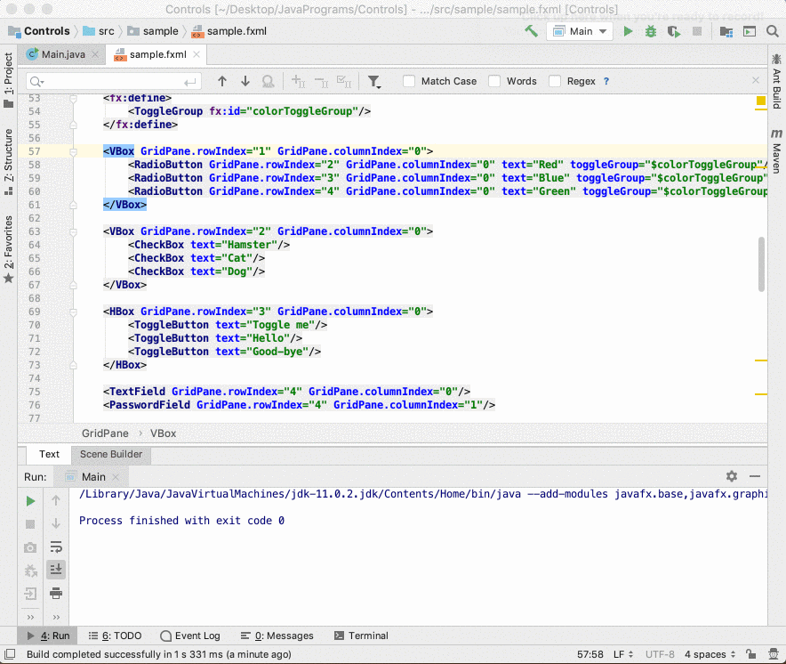

---

#### RadioButton
The radio button offers the user with various options, but only one option can be selected at the time
+ Togglegroup: limits radio button to have only one option selected 
+ Select: keyword that allows one option to be the default selection

```java

<fx:define>
        <ToggleGroup fx:id="colorToggleGroup"/> 
</fx:define>

<VBox GridPane.rowIndex="1" GridPane.columnIndex="0">
    <RadioButton GridPane.rowIndex="2" GridPane.columnIndex="0" text="Red" toggleGroup="$colorToggleGroup"/>
    <RadioButton GridPane.rowIndex="3" GridPane.columnIndex="0" text="Blue" toggleGroup="$colorToggleGroup" selected="true"/> // option blue will be the defualt option
    <RadioButton GridPane.rowIndex="4" GridPane.columnIndex="0" text="Green" toggleGroup="$colorToggleGroup"/>
</VBox>
```
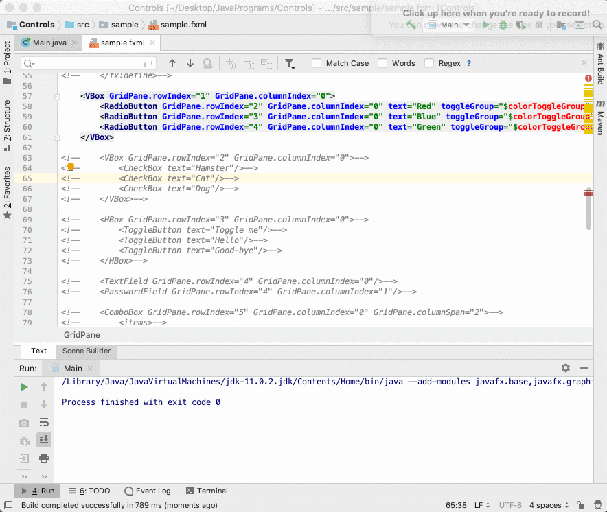


--- 

#### CheckBox
Different from the radio button, checkbox gives the user various options and the user can select multiple options at once
+ Indeterminate: keyword that makes option display a "-" instead of a checkmark
        - It's a rare case, one of the examples can be when options in a group are partially selected

```java
<VBox GridPane.rowIndex="2" GridPane.columnIndex="0">
    <CheckBox text="Hamster"/>
    <CheckBox text="Cat"/>
        <CheckBox text="Dog"/>
</VBox>
```
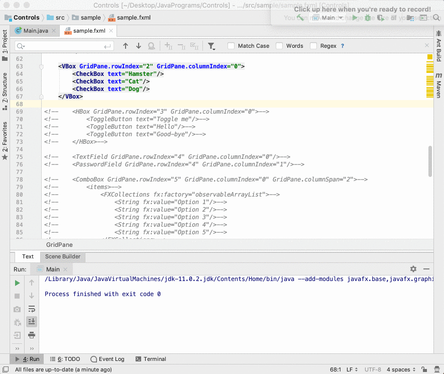

---

#### ToggleButton
A button that will be shown as "selected" or "unselected"

```java
<HBox GridPane.rowIndex="3" GridPane.columnIndex="0">
    <ToggleButton text="Toggle me"/>
    <ToggleButton text="Hello"/>
    <ToggleButton text="Good-bye"/>
</HBox>
```
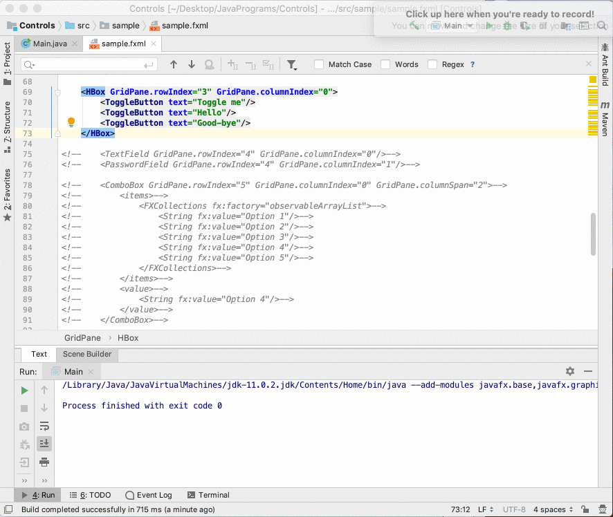

--- 

#### TextField & PasswordField
Both textfield and passwordfield are empty input box that accepts some text
+ TextField's text will be displayed 
+ Password's text will not be displayed


```java
<TextField GridPane.rowIndex="4" GridPane.columnIndex="0"/>
<PasswordField GridPane.rowIndex="4" GridPane.columnIndex="1"/>
```


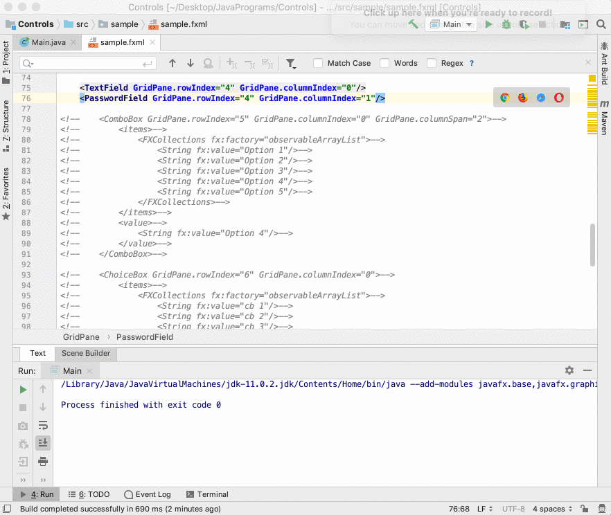

--- 

#### ComboBox 
Similar to radio button, only one option will be selected at the time. However, options will be collapsed together instead of being all visible 
+ Default: combo box can have a default value by putting option inside the `<value>` tag
+ Editable: allow user to type option by setting `editable = "true"`

```java
<ComboBox GridPane.rowIndex="5" GridPane.columnIndex="0" GridPane.columnSpan="2">
    <items>
        <FXCollections fx:factory="observableArrayList">
            <String fx:value="Option 1"/>
            <String fx:value="Option 2"/>
            <String fx:value="Option 3"/>
            <String fx:value="Option 4"/>
            <String fx:value="Option 5"/>
        </FXCollections>
    </items>
        <value> //  set option 4 to the default option
                <String fx:value="Option 4"/>
        </value>
</ComboBox>
```
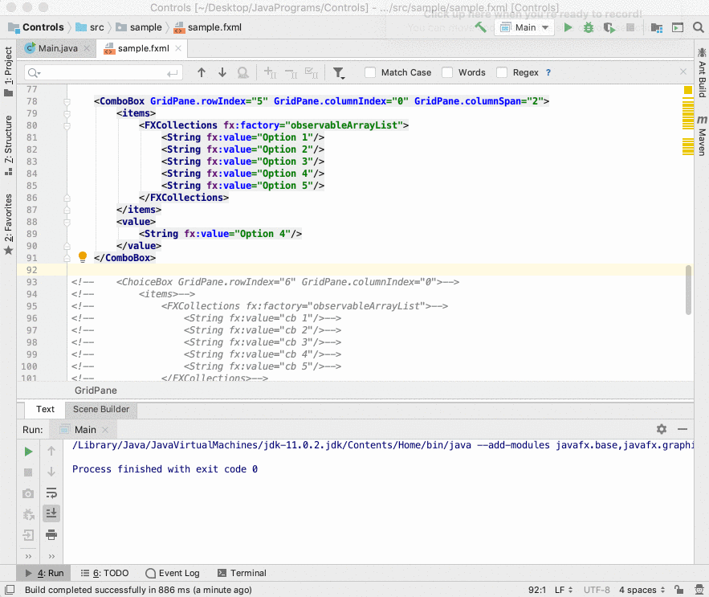

--- 

#### ChoiceBox 
Very similar to the combo box, but a checkmark will be displayed in front of the value.
+ It's used for less option
+ Less common than a combo box

```java
<ChoiceBox GridPane.rowIndex="6" GridPane.columnIndex="0">
    <items>
        <FXCollections fx:factory="observableArrayList">
            <String fx:value="cb 1"/>
            <String fx:value="cb 2"/>
            <String fx:value="cb 3"/>
            <String fx:value="cb 4"/>
            <String fx:value="cb 5"/>
        </FXCollections>
    </items>
</ChoiceBox>
```
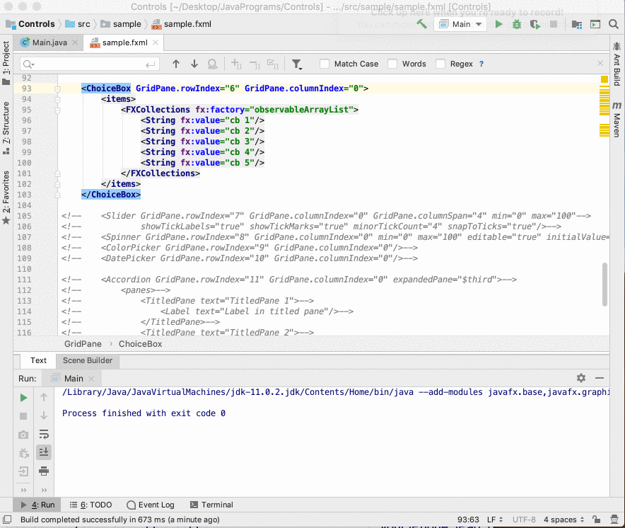

--- 

#### Slider 
A slider allows the user to slide a scale and return its value
+ Min: sets the minimum for the slider
+ Max: sets the maximum for the slider
+ Showticklabels: shows the number label of the slider 
+ Showtickmarks: shows the more specific scale (tick) of the slider 
+ Minortickcount: sets the size of specific scale (tick)
+ Snaptoticks: forces the slider to move to the closest tick
+ Orientation: changes the orientation of the slider

```java
<Slider GridPane.rowIndex="7" GridPane.columnIndex="0" GridPane.columnSpan="4" min="0" max="100"
            showTickLabels="true" showTickMarks="true" minorTickCount="4" snapToTicks="true"/>
```
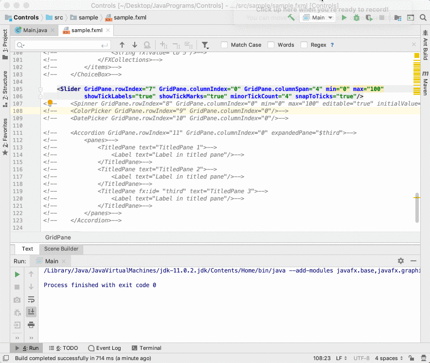

---

#### Spinner 
A spinner allows the user to select a value from a set of value but clicking or typing in the value
+ Min: sets the minimum for the spinner
+ Max: sets the maximum for the spinner
+ Editable: makes the spinner editable
+ InitialValue: assigns the spinner with a default value

```java
<Spinner GridPane.rowIndex="8" GridPane.columnIndex="0" min="0" max="100" editable="true" initialValue="50"/>
```
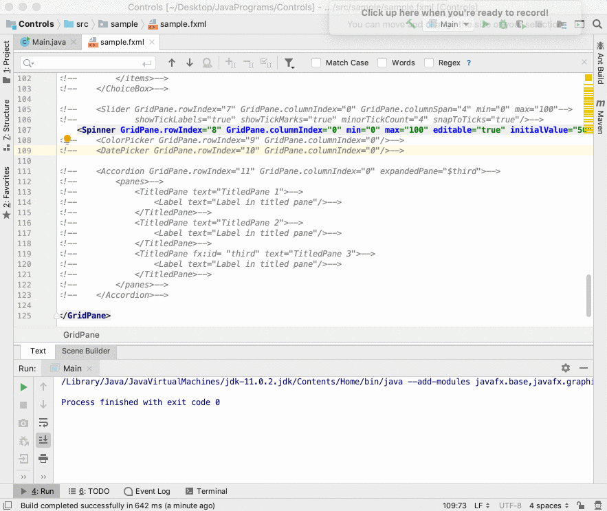

---

#### ColorPicker 
A color picker allows the user to pick a color from the color panel or using RGB code

```java
<ColorPicker GridPane.rowIndex="9" GridPane.columnIndex="0"/>
```
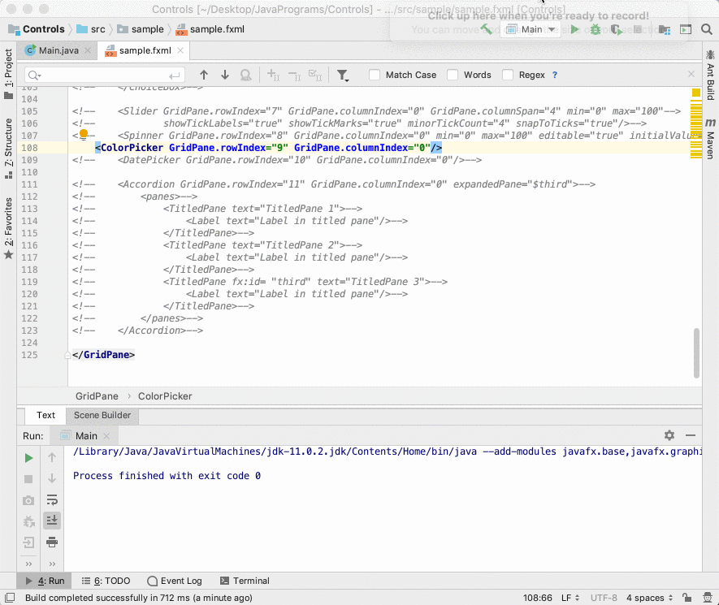

---

#### DatePicker 
A date picker allows the user to pick a date and returns its value

```java
<DatePicker GridPane.rowIndex="10" GridPane.columnIndex="0"/>
```
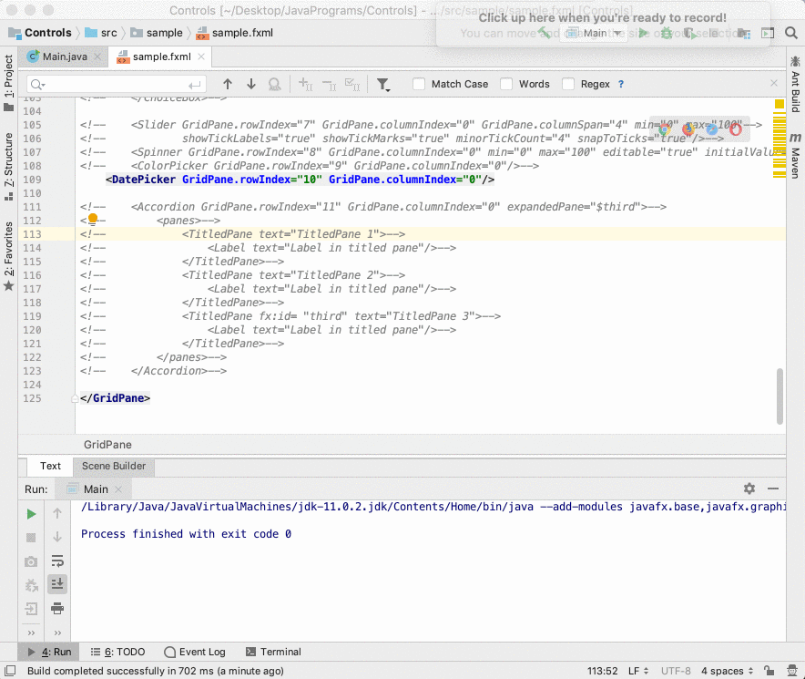

---

#### TitlePane
A TitlePane is what makes options collapse under another option
+ Accordion
+ expandedPane: make one option initially expended instead of a collapsed state

```java
<Accordion GridPane.rowIndex="11" GridPane.columnIndex="0" expandedPane="$third">
    <panes>
        <TitledPane text="TitledPane 1">
            <Label text="Label in titled pane"/>
        </TitledPane>
        <TitledPane text="TitledPane 2">
            <Label text="Label in titled pane"/>
        </TitledPane>
        <TitledPane fx:id= "third" text="TitledPane 3">
            <Label text="Label in titled pane"/>
        </TitledPane>
    </panes>
</Accordion>
```
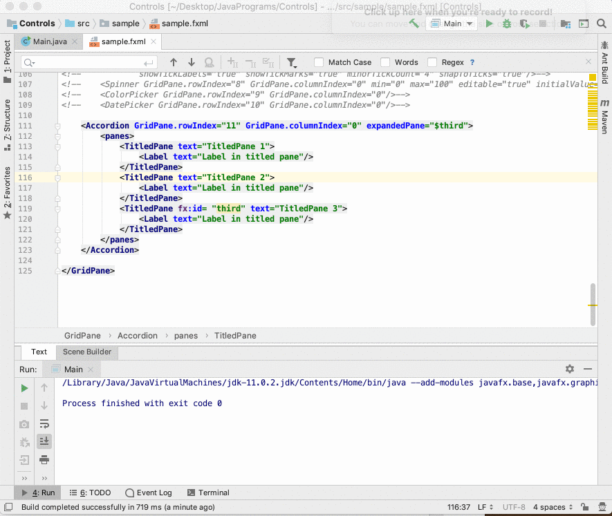

---

### Now what?

After learning some UI control, I start tinkering around with the event which has a very similar function as Ruby event. "Event" is something that happened when a specific condition is met (or when "event-listener" is being triggered). For example, an event listener can be the button, and when the button is being clicked, it will trigger the method inside the controller.
Following are some examples :chestnut:
+ onKeyReleased: when a key has been released, a specific method that is linked to it will start running
        - `onKeyReleased="#handleKeyRelease"`: when a key released, method handleKeyRelease will run
+ onAction: when a button was clicked, a specific method will run
+ And more save for the next week!

### A Small Anecdote
So I was following the online curriculum on how to add an icon/image inside the button, and the instructor asks me to download a file that contains all the commonly used Java icon. However, I didn't want the logo to be one of the commonly used logos (I wouldn't tell you that I was lazy to download the file), so I tried to add a logo from my own computer. What I want to do is the following:
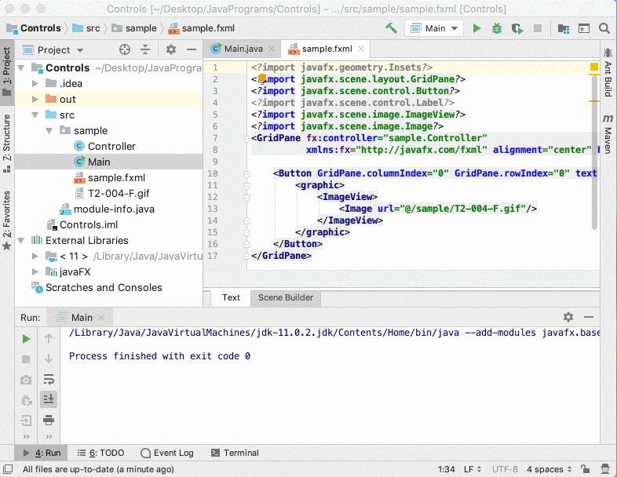

I guess it was not that hard since I see how it works with the example. So I follow the instruction and move the folder inside the project I created. Nope, does not work, I wonder if there is anything to do with the image link. So I browse StackOverflow in hope of finding something useful. Fortunately, I found someone with a similar issue; Unfortunately, no one answers his/her question. I guess it's time for Rubber-duck (or rubber-chicken :hatching_chick: because I got it instead of a duck) debugging. 
So I tried to move the image out the folder, change the name of the image and folder, change the path of the file, give it an online link. None of the above work. Then I remove the file and add it again, but this time, inside the source folder of the project. And Ding-Dong :bell:! Problem Solved!

### Takeaway
1. It's all about to try and fail. When you believe you understand a problem, try to do the problem again with a different approach. Or even better, you can invent a similar problem and try to solve them. In addition, when you fail, it means you are doing something challenging, and you can only improve by trying things that are hard for you. All roads lead to Rome, you might take some time, but you will get there eventually. :satisfied:


---
### Notes:
+ `fx:id` assign an ID to a specific object (similar to HTML & CSS)


