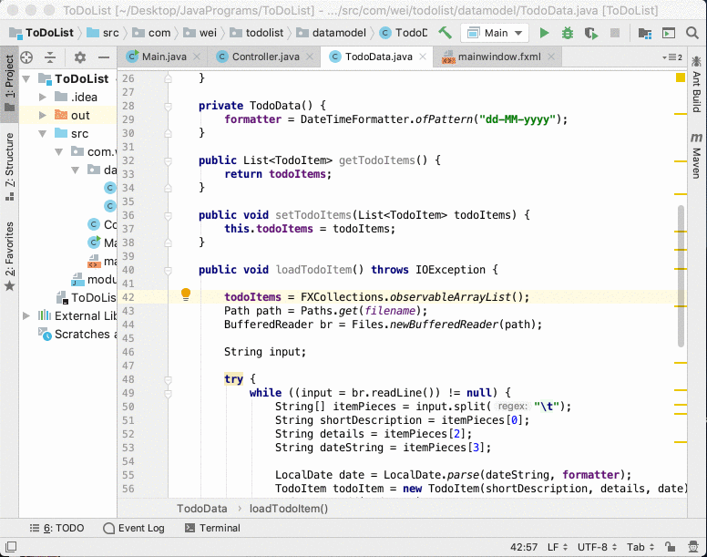
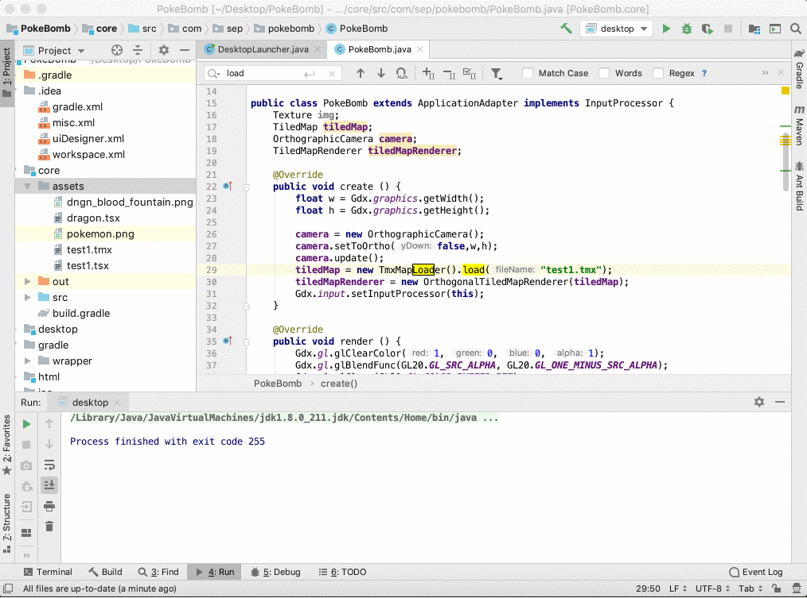
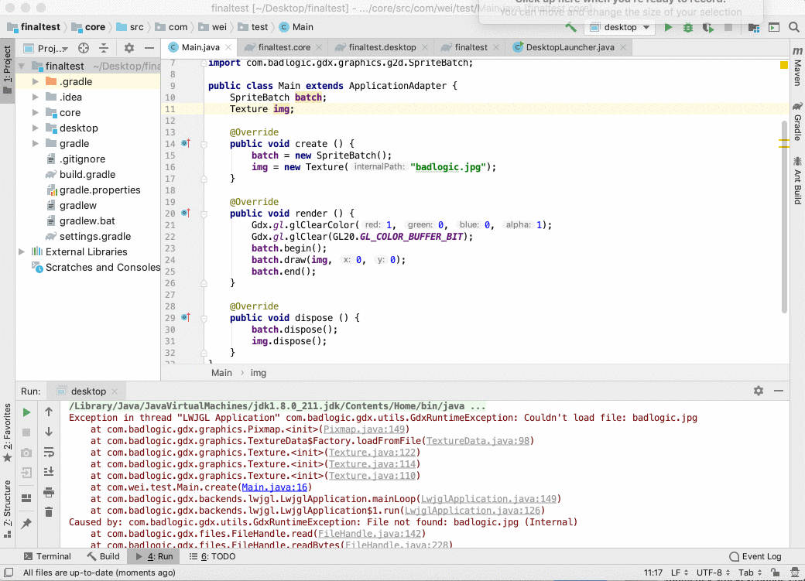
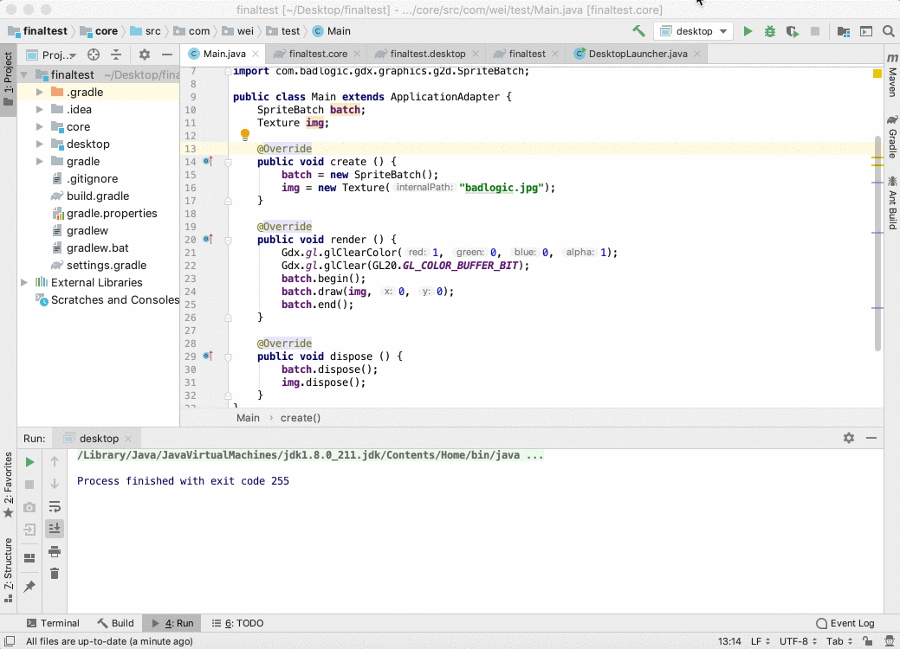
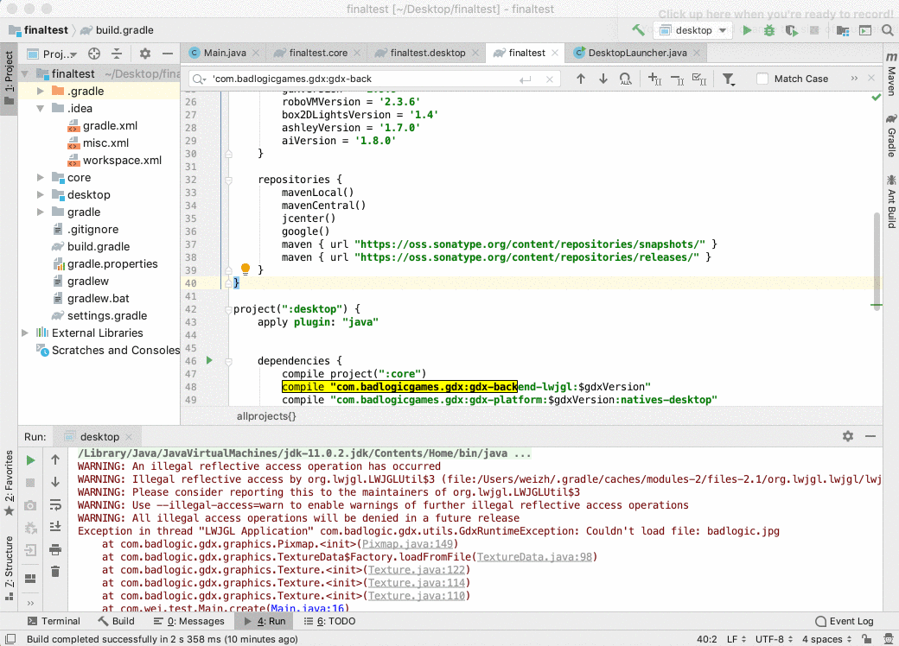
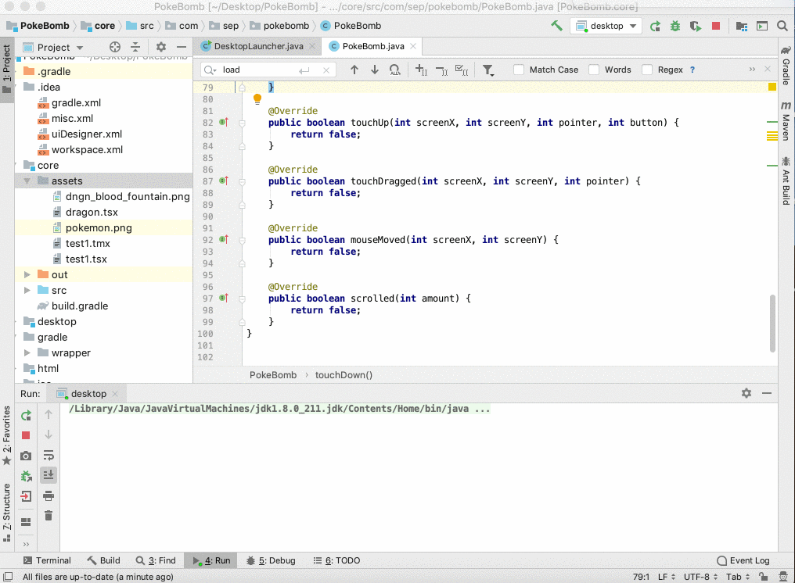
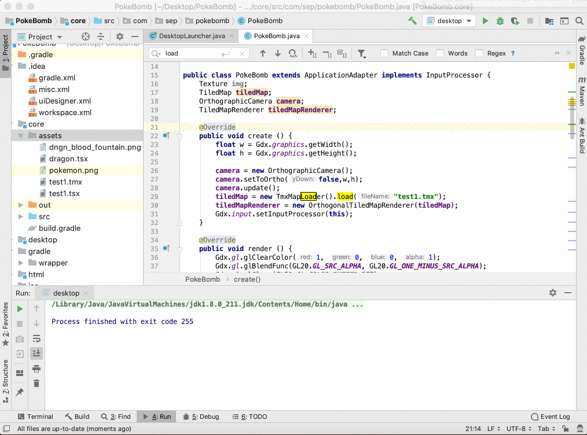
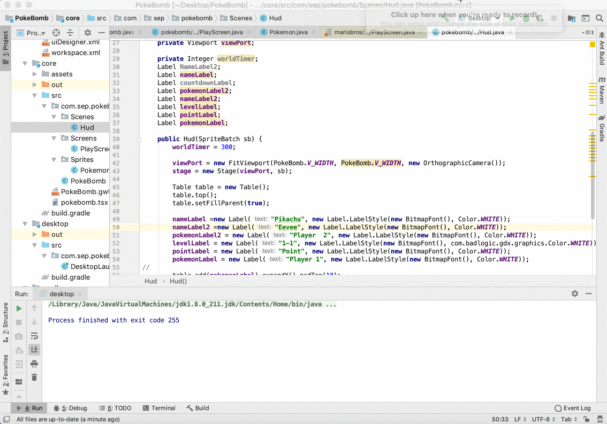

## Entry 5: Continue? Yes, Continue. :collision:
---

### A 2 A.M. Blog

Hi guys, it's 2:18 AM when I was drafting this blog. Why? I guess because I'm paying the debt for not working hard this week, _*or*_ all the previous weeks. Time goes really fast, and when I was filling out my form regarding which project I want to present in the expo, I literally have *NOTHING* done. As a result, MVP (Minimum Value Product) is my top first priority, or perhaps, a MMMMMVP. This is going to be one of my toughest days, but I also gain a lot from this experience.

---

### I Do Not Know If They Are Useful, But I Guess Not

I continued with my video lessons. Here is something I heard:
+ Runnable
+ UI Thread
+ VBox.vgrows
+ Singleton

These are the things I learned from the videos:
+ 
+ 
+ 

Okay, I’m exaggerating it, but I don't think the curriculum will be helpful from this point on. So I stopped after a Todo List App which I found somewhat helpful. The todo list app basically utilize all the information provided previously in the course, and this is what it looks like:



Pretty cool! :sunglasses: And here comes the challenge, what is the difference between these two blocks of code below?

Code # 1
```java
todoListView.getSelectionModel().selectedItemProperty().addListener(new ChangeListener<TodoItem>() {
        @Override
        public void changed(ObservableValue<? extends TodoItem> observable, TodoItem oldValue, TodoItem newValue) {
                if(newValue != null) {
                        TodoItem item = todoListView.getSelectionModel().getSelectedItems();
                        itemDetail.setText(item.getDetails());
                }
        }
});
```

Code # 2
```java
todoListView.getSelectionModel().selectedItemProperty().addListener(new ChangeListener<TodoItem>() {
        @Override
        public void changed(ObservableValue<? extends TodoItem> observable, TodoItem oldValue, TodoItem newValue) {
                if(newValue != null) {
                TodoItem item = todoListView.getSelectionModel().getSelectedItem();
                itemDetail.setText(item.getDetails());
                }
        }
});
```

Did you find it? It's on line #5, `getSelectedItems();` versus `getSelectedItems();`. To be honest, I didn't find the error, and I was pretty frustrated at that point. Luckily, I have Google, "Code Difference Comparison" is what I typed, and successfully, I was able to solve the problem with an online checker. Also, an important lesson learned: every detail matters.

---

### Did you said Swing? I thought it’s Dead Already
I decided to learn about Swing since that's what Java people in my class is learning. Without doing much of research, I jumped right into it. This time, I learn with documentation instead of videos. After a few days of learning, I search up Swing in the Chinese search engine in the hope to find some resource in my first language. And sadly, all I got from it is to move on from  Swing and start learning JavaFX, because "Swing is dead." I don't know if it's really the case, but I just decided to go back to JavaFX since that's what I have been learning so far. But anyway, here are some of the note I took for Swing.

```java
import javax.swing.JFrame; JFrame widget = a toplevel container

// set up a window 
public class Simple extends JFrame {
    public Simple() {
        setSize(300, 200); // set the size of the screen
        setTitle("Simple"); // set the title of the window
        setDefaultCloseOperation(EXIT_ON_CLOSE); // give the close button a function 
    }
    public static void main(String[] args) {
        Simple simple = new Simple();
        simple.setVisible(true); // show the window
    }
}


import java.awt.Dimension;
import java.awt.Toolkit;
import javax.swing.JFrame;

// make the screen center
public class CenterOnScreen extends JFrame {
    public CenterOnScreen() {
        setSize(300, 200);
        setTitle("CenterOnScreen");
        setDefaultCloseOperation(EXIT_ON_CLOSE);
        
        Toolkit toolkit = getToolkit(); // built-in toolkit class
        Dimension size = toolkit.getScreenSize(); // use the class to find out the size of user's pc screen
        setLocation(size.width/2 - getWidth()/2, size.height/2 - getHeight()/2); // x,y locations
    }
    public static void main(String[] args) {
        CenterOnScreen cos = new CenterOnScreen();
        cos.setVisible(true);
    }
}


import java.awt.Dimension;
import java.awt.Toolkit;
import java.a

public Buttons() {
    setTitle("Buttons");
    setSize(300, 200);
    toolkit = getToolkit();
    Dimension size = toolkit.getScreenSize();
    setLocation((size.width - getWidth())/2, (size.height - getHeight())/2);
    setDefaultCloseOperation(EXIT_ON_CLOSE);
    
    JPanel panel = new JPanel(); // It is a generic class used to group other Components together* 
    getContentPane().add(panel); // adding JPanel into the JFrame
    panel.setLayout(null); // change the flow into position absolute 
    
    JButton beep = new JButton("Beep"); // create a JButton (button that will result in action when click)
    beep.setBounds(150, 60, 80, 30); // make the position of the button absolute (artifically set the position)
    beep.addActionListener(new ActionListener() {
            public void actionPerformed(ActionEvent event) { // click
            toolkit.beep(); // when button click, it will beep *
        } // 
    });
    
    JButton close = new JButton("Close");
        close.setBounds(50, 60, 80, 30);
        close.addActionListener(new ActionListener() {
            public void actionPerformed(ActionEvent event) {
                System.exit(0); // close the program
            }
        });
    
        panel.add(beep); // adding the button to the panel (JPanel)
        panel.add(close);
    }
    public static void main(String[] args) {
        Buttons buttons = new Buttons();
        buttons.setVisible(true);
    }
}
```
[Also, let's heard other's opinion on Swing]:https://www.reddit.com/r/java/comments/49kl35/is_java_swing_dead/

References:
+ https://grid.cs.gsu.edu/~cfrederick/csc4380/slides/The_Java_Swing_tutorial.pdf
+ https://stackoverflow.com/questions/13212431/jpanel-vs-jframe-in-java
+ https://docs.oracle.com/javase/tutorial/uiswing/events/actionlistener.html

--- 

### Maybe it's a MMMMMMMMVP?
For our final project, my group decided to do a bomber-man game, and it's what I played for my entire childhood. I don't know if my teammates are aware or not, I want to make it with the Pokemon theme (hopefully they can tell with the image I sent them. :sweat_smile:

So after I devoted my 15 hours into this project, that's what I have so far :satisfied:


 
It was quite hard to get to this point although it looks literally like a picture I pulled from the internet. Here is what I did:
1. First of all, I used Tiled to edit the map with 16px * 16px tileset
2. Use LibGDX to parse the TMX file (the map created by Tilded)


3. Download JDK 1.8 because LibGDX causes the program to return a warning in which I need to downgrade the JDK version

4. Watch Youtube videos on how to use LibGDK parse the map



It does not sound like a lot, but it is. Because of a different version, different platform, and a variety of other reasons, things just don’t work the way I want them to be. But Google is always your best friend if you don't know how to solve it, ask it.


Thanks to the people on the internet that helps people like me, kudos to them! 

https://stackoverflow.com/questions/53600893/libgdx-could-not-determine-java-version-11-0-1

https://gamedev.stackexchange.com/questions/135589/basic-libgdx-game-wont-run

https://libgdx.badlogicgames.com/ci/nightlies/docs/api/com/badlogic/gdx/graphics/Texture.html 

And kudos to me, I made it before the deadline!! :confetti_ball:
Finally, a snick peek of next week!


---


### Takeaway
1. Always remain curious and persistence, if you don’t know something, ask it. There are myriad of brilliant individuals who are willing to help you. There is no such question as stupid question, you can always get an answer for a question when you type in Google. Even if you don't get one, post it online, and maybe your question will help other people in the future.
2. Although I didn’t mention this in my entry, I always promised myself to work hard so I don’t regret what I did. I think I did it this week, finished all my AP Exam plus finishing this blog on time. Never stop doing what makes you happy, and be proud of what you do.


