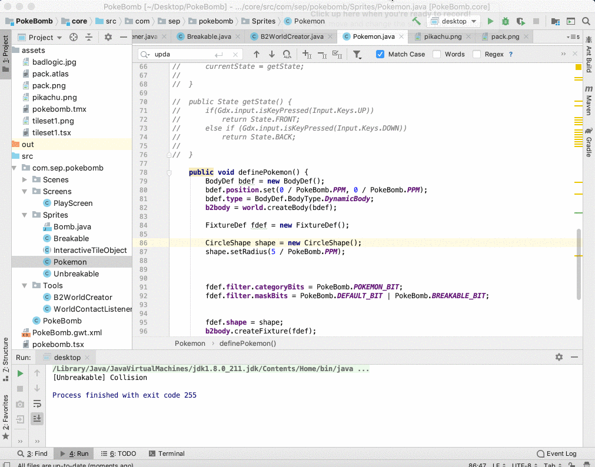
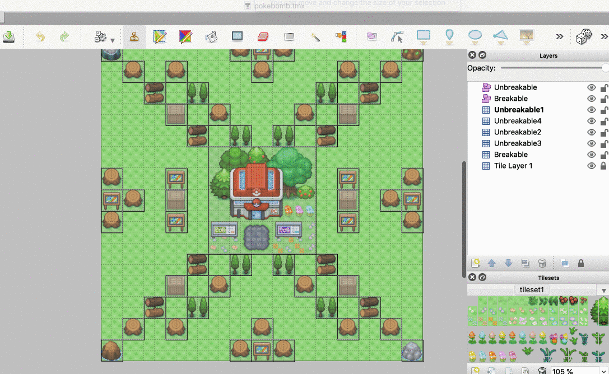

## Entry 7: Teamwork Builds Dreamwork :100:
---

### Work, work, work, work

So this week is the last week before the expo, and my group is trying our best to build a MVP so we can present it on the expo next week. At this point, I didn't go to learn new information, but instead, applied what I learned into this project. Definitely, there is still a lot of new information that is completely unfamiliar to me because I'm using a Java library, but besides that, it's just about fail-explore-try.


---

### So what exactly do we want to do?

Let's look at our to-do list:

PokéBomb
- [ ] Layout
  + [X] Spawn point
  + [X] Self-designed map
  + [X] Tiled system
  + [X] Pokemon theme & sprite
  + [X] Edge of each black
  + [X] Home page
  + [ ] Edge of each map

- [ ] Animations:
  + [ ] Walking animation
  + [ ] Bomb explosion, a cross shape
  + [ ] Border
  + [X] Breakable blocks and unbreakable blocks
  + [ ] Death animation
  + [ ] Items
    + [ ] Fuel
    + [ ] Bomb
    + [ ] Gloves
    + [ ] Hammer
    + [ ] Shoes

- [ ] Sound:
  + [ ] Blast explosion
  + [ ] Bomb plant
  + [ ] Winning 
  + [ ] Items
  
At a certain level, we have a MVP that is presentable to the SEP expo, and here is a demo of our project


---

### What I Done so far

#### Control
So, I was able to incorporate the user control into this project with graphics. The function below is pretty self-explanatory, it's a method that causes character (spirit/image) to do certain action depending on user-input.


```java
public void handleInput(float dt){
        if (Gdx.input.isKeyPressed(Input.Keys.UP) ) // when user press on up arrow
            player.b2body.setLinearVelocity(0,0.8466666667f); // character will move at velocity of 1pixel per second
        if (Gdx.input.isKeyPressed(Input.Keys.DOWN) ) // down arrow
            player.b2body.setLinearVelocity(0,-0.8466666667f);
        if (Gdx.input.isKeyPressed(Input.Keys.LEFT) ) // left arrow
            player.b2body.setLinearVelocity(-0.8466666667f,0);
        if (Gdx.input.isKeyPressed(Input.Keys.RIGHT) ) // right arrow
            player.b2body.setLinearVelocity(0.8466666667f,0);
    }
```
---

#### Spawn
In order to start the game, the character should appear in some position of the map. Although my group is still discussing which point should be the spawn, the code for this purpose is ready! So, it's about time to decide where the spawn should be, and let me know what you think!


---

#### Tiled Map
Tiled map is basically a map that is made up by each little boxes. I created our map using "Tiled" App, and within the map, there will be a different layout for each object.

And using the tiled map I was able to try this into a map in the actual game that I'm going to make.

```java
mapLoader = new TmxMapLoader();
map = mapLoader.load("pokebomb.tmx"); // make this tmx(tiled extension file) as the map of the game
```



---

#### Debugging line
Debugging line is what allow the programmer to see the interaction between each object within the program. The green line below is the debugging line, and when Pikachu collides with a breakable object, it will print out breakable so I can see how they interact with each other.


```java
//for breakable
for(MapObject object : map.getLayers().get(6).getObjects().getByType(RectangleMapObject.class)) { // get the outline of layer 5 on Tiled map
  Rectangle rect = ((RectangleMapObject) object).getRectangle(); // and draw the outline

  new Breakable(world, map, rect);
}

// for unbreakble
for(MapObject object : map.getLayers().get(7).getObjects().getByType(RectangleMapObject.class)) {
  Rectangle rect = ((RectangleMapObject) object).getRectangle();

  new Unbreakable(world, map, rect);
}

```

---
### What Did My Teammate Do?

We split into three groups each doing a different part of the project.

#### Home Page
Johnson is doing a home screen for the game in which the user can interact with to start the game and select the mode they want to play. Here is a link to his [entry](https://github.com/johnsonw6558/independent_study-java/blob/master/entries/entry7.md)

#### Multiplayer & Text Packer
Jeffery, on the other hand, is trying to figure out how to make our game multiplayer. He also wants the multiplayer not only limited to the local level, but instead, the player can play with their friend online. In addition, he helps me to pack all the textures (Pikachu), so I can actually use it in our game. The texture packer is mainly used for the animation in which we are still currently working on, and Here is the link to his [entry](https://github.com/Jeffreyg2240/Independent-Study-Java/blob/master/entries/Entry_7.md)

---
### Reflection
I actually feel pretty stressful this past week because I need to have a MVP done by Tuesday. Even after A.P. tests, there are still a lot more to do such as preparing for a quality of life competition. Initially, I tend to keep myself in my own world until I was finally feeling stress and asking for help from my teammate. Luckily, they are great teammate not just in term of productivity, but also giving good suggestion. Shout out to my teammate for offering me so much support throughout this process and I really appreciate it.

---
### Takeaway
1. It's okay to rely on someone else, nobody is perfect. When you asking help from someone else, it does not mean that others are better than you, it just means that you need someone to talk to, so you can recharge your energy, and get back to work again!


