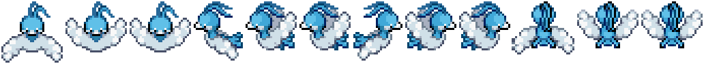
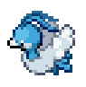
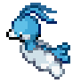
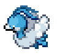
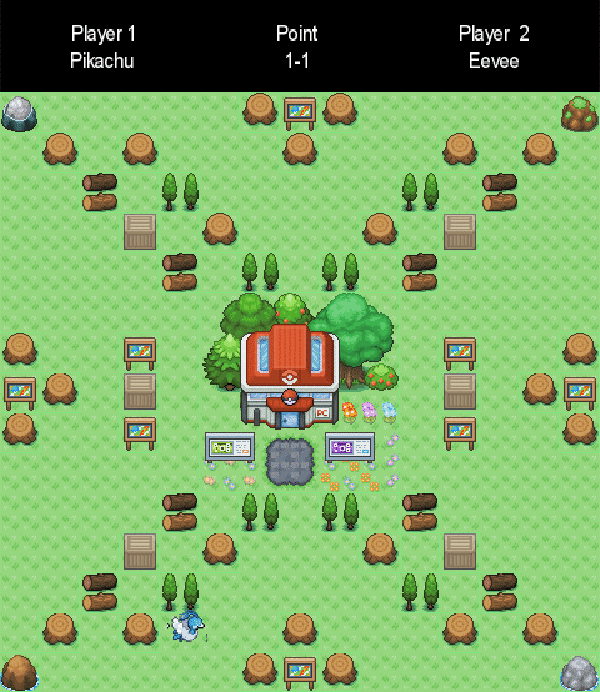
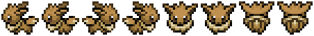
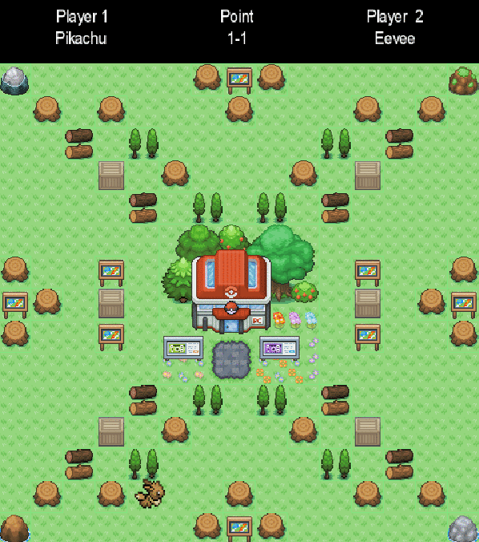

## Entry 8: Learn Well, Work Well, Sleep Well
---

### Stress Relief

This is already the eighth week of the independent study, I'm proud of myself for making this far. Throughout this process, I spent a lot of time learning about the thing that I would never image myself learn before joining this class. On the other hand, it was the most stressful eight weeks of my life. I sometimes panic about finishing this blog because I do not know if I show enough learning for the week, especially this blog often takes more time than I would expect and wanted. After the SEP expo, I finally felt relief. I'm glad of what I made, but I think it is also time for me to take a small break, to sleep regularly. Anyways, I put down anything I learned this week in this entry, and hope you can find this helpful. 

---

### MVP and Expo Day

So Johnson and I presented our MVP in the SEP expo. We did not yet have a chance to connect our files together, so we present the files separately. We also have chance to visit other group's project, and I just want to shout out to [Xiurong](https://github.com/xiurongy3506/swift_independent_study), [Jennifer](https://github.com/JENNIFERL4209/mysql-independent-study), [Travis](https://github.com/travism7618/nasa-pod), and Josiah for made into the finalist, and congrats for everyone for presenting their awesome project.


---

### Texture Packer
Initially, I followed the instructions of the tutoring on how to combine all texture (the character) in one image. However, the application that was provided in the video cannot be open on my computer. Therefore, as the alternative, I try out several other application and finally was able to pack all the texture. Following is my end product.



The process is actually not that fun, it's actually not convenience at all. First of all, the problem with the texture is that I have images that contain multiple pokemon. Therefore, I need to crop out the pokemon one at the time. Then, I need to combine textures that are in the same motion so I can pack them first. Lastly, I need to combine all textures together in order to get the animation of that specific pokemon. 





---
### Animation
So after I pack all the textures together, I will need to make it into animation. The tricky things about making animation are that each texture has a different width, even though I tried my best to make it perfectly cut, it's still obvious there is a deficit on the animation just as you can see on the following gif.



As the solution, I decided to do a different pokemon in which I will make all the texture equal size so the animation will be more smooth.




Now I got the animation that runs more smoothly, but more importantly, we have Eevee now!! Below is the code snippet of the animation.

```java
Array<TextureRegion> frames = new Array<TextureRegion>(); // set up an array for animation

for(int i = 0; i < 2; i++) // adding the left animation (index 0 and 1) into the array
    frames.add(new TextureRegion(getTexture(),  i*57, 1, 57, 52)); // get the position of the texture
pokemonRunLeft = new Animation(0.1f, frames); // this will be the left animation of eevee
frames.clear();

for(int i = 2; i < 4; i++)
    frames.add(new TextureRegion(getTexture(), i*58, 1, 57, 52));
pokemonRunRight = new Animation(0.1f, frames);
frames.clear();
for (int i =6; i < 8; i++)
    frames.add(new TextureRegion(getTexture(), i*57, 1, 57,52));
pokemonRunUp = new Animation(0.1f, frames);
frames.clear();
for (int i =4; i <6; i++)
    frames.add(new TextureRegion(getTexture(), i*58, 1, 57,52));
pokemonRunDown = new Animation(0.1f, frames);
frames.clear();
```
---

### Control
There was a big problem with our game last week, which is that the character will go out of the screen. So Jeffery and I divided the work. While I was fixing the problem with animation, he moved on to add boundary of our game. Although combining our code was a major issue, we manage to make it work. Teamwork!



---

### My Team
Meanwhile, my team is trying to link every piece together as the deadline approaches. Johnson talked us through on what he wants on the home screen, and Jeffery and I give him some suggestion on the style and layout of the home page. More importantly, however, we ask him to link the page with the game so we wouldn't present it in separate pieces. Additionally, Jeffery and I made two copy of the files and working on a different perspective of the game. Time for the final push!

---

### Changing the Path?
Currently, our major challenge is the bomb which is the essential component of this project. Although my teammates and I have tried countless time to produce a bomb according to user's input, it did not seems to work. One suggestion from our peer is that we can make it a Pac-man game instead of a Bomberman which is definitely a good idea since we literally have every component of Pac-man beside counting the point. On the other hand, I found a tutorial online that might be helpful to my team to make the bomb to work, but it might take time to understand it all. Therefore, we will continue to explore different possibility and make sure what can have a product that we are proud to present to the classmate. But in the end, all I want to say is that you should always take care of yourself. Learn well, but also sleep well.


---
### Takeaway
1. Teamwork builds dreamwork. Although people have countless ideas in mind, they are not necessarily the same idea. Maybe your teammate has a different approach than yours, but it's important to talk to them on what they want and how it can be a constructive idea to yours.


