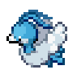
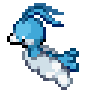
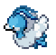

## Entry 9: Last Minute Struggle
---

### Final Week

This is the last week for my independent study project, but hopefully, this will not be my last blog. Although I will present my project to the whole class soon, I'm still not content of what I made so far. Therefore, I hope to continue learning and finish building this little game.

---

### Progress

As mentioned last week, my team is making the final polish on the game. However, the main component of the game still seems missing, which is the bomb. It's extremely tough to produce a bomb, and I will explain it later on in my blog. However, thanks to my teammate, we were able to accomplish a lot of things this week. For example, the background music, explosion sound effect, button linkage to the main game and etc.


---

### Bomb

There are many reasons causes building a bomb difficult. First of all, because I use a tutorial for building SuperMario while I was working on my game. I used a lot of concepts I learned from the tutorial and apply it to my project. However, because it's a totally different game, not everything I needed is being taught in the video. For example, I learned how to make a character, and manipulate its motion by user input. However, a bomb is different. Although they are both an object (sprite), the bomb does not display on the screen all the time, instead, it only appears on the circumstance, and should be disappearing after a period of time. Below gif is what my teammates and I have accomplished so far.


So the problem with the bomb now is that it only has an appearance. In other words, it does not explode (animation), nor does it break the block nearby. In addition, you can only have one bomb exist at the time which I consider as insufficient.





---
### Animation
I tried to do the animation of the bomb but failed to achieve it. Below are some of the texture I created for the bomb animation.


Now I got the animation that runs more smoothly, but more importantly, we have Eevee now!! Below is the code snippet of the animation.

---

### Break
So I want to make the bomb break the nearby block, but it was not quite successful, but I will show you what I did, and explain my ideas.

```java
public void defineBomb() {
    BodyDef bdef = new BodyDef(); // create a body
    bdef.position.set(getX(),getY()); // set the position of body
    bdef.type = BodyDef.BodyType.DynamicBody; // it's free moving object
    b2body = world.createBody(bdef);

    FixtureDef fdef = new FixtureDef(); // create a fixture

    CircleShape shape = new CircleShape(); 
    shape.setRadius(12 / PokeBomb.PPM); // a circle with radius of 12

    fdef.filter.categoryBits = PokeBomb.POKEMON_BIT;
    fdef.filter.maskBits = PokeBomb.DEFAULT_BIT | PokeBomb.BREAKABLE_BIT;

    fdef.shape = shape; // make the fixture the circle
    b2body.createFixture(fdef).setUserData("head"); // make the fixture move with body, and assign it to "head" in which will break the block
}


```

---

### Presentation

As part of this capstone project, presentation is required. Therefore, I was working on the powerpoint and writing the script for the presentation. I also communicate to split an equal amount of work for the presentation.

---

### My Team
My teammates had successfully combined the home screen with the game screen, as well as adding randomized background music for the game. Finally, they add the sound effect when the block break, and we are all preparing for the presentation.

---


---
### Takeaway
1. No good idea can be achieved overnight. You can always polish your project, and even you face difficulty, do not give up. In addition, never stop learning, even if you are finishing an assignment for a class, you should continue to explore on your own.


